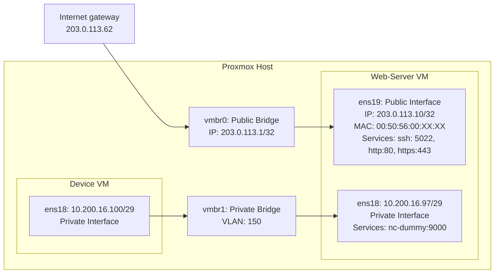

# Automated Infrastructure with Terraform and Ansible

## Overview

This repository automates the provisioning and configuration of a secure web server using **Terraform** and **Ansible**. It is designed to work seamlessly with **Proxmox Virtual Environment (PVE)** for managing virtual machines and networking. The project includes robust configurations for networking, security, and web services.

### Key Features

1. **VM Provisioning with Terraform**:
   - Automates VM creation and networking on Proxmox VE.
   - Uses Cloud-Init for seamless initial VM setup.

2. **Configuration Management with Ansible**:
   - Deploys and configures Nginx with HTTPS (Let's Encrypt).
   - Implements UFW-based firewalls and Fail2Ban for security.
   - Configures SSH with hardened settings (custom port, no root login).

3. **Networking**:
   - Public and private interfaces with VLAN tagging.
   - Ensures traffic isolation and security between internal and external networks.

4. **SSL/TLS**:
   - Automates the generation of SSL certificates with Let's Encrypt for `nip.io`.

### Mock project

For the purpose of testing, we will try to replicate the following setup.

1. Spin-up with Terraform an Ubuntu VM that has two interfaces: one external Interface and one internal Interface.

2. The internal Interface is connected to a Device (10.200.16.100/29) that will need access to the VM's port 9000/tcp.

3. The VM and the Device are connected to vSwitch's ports that only accept vlan tagged packets with the vlan ID 150 for the internal interface.

4. The external interface is exposed to the Internet with a public IP.

5. Using ansible Install and configure a Web- and SSH-Server that listens only on the external interface.

6. Secure the server with Ansible.

---

## Why These Tools?

### Proxmox VE
- **Open Source**: based on QEMU/KVM and LXC. Can manage virtual machines, containers, highly available clusters, storage and networks with an integrated, easy-to-use web interface or via CLI.
- **VLAN Support**: Built-in vSwitch with VLAN tagging simplifies network segmentation.
- **API Integration**: Supports Terraform for infrastructure as code (IaC).
- **Open vSwitch Integration**: Open vSwitch provides most of the features of a physical switch, like RSTP, VXLANs, OpenFlow, and supports multiple vlans on a single bridge.

### Hetzner
- **Cost-Effective**: Affordable bare-metal servers with high performance.
- **Pre-configured Networks**: Public and private IP ranges simplify setup.
- **Community Resources**: Hetzner provides a ready-to-use [guide for Proxmox VE setup](https://community.hetzner.com/tutorials/install-and-configure-proxmox_ve).

### Open vSwitch on Proxmox
- **Hetzner’s vSwitch** cannot be used directly because it only supports VLAN IDs in the range 4000–4091.
- **VLAN Flexibility:** Allows any VLAN ID, including VLAN ID 150
- **VLAN Remapping (Optional):** If you need to integrate with Hetzner’s vSwitch, Open vSwitch can remap VLAN ID 150 to an allowed range for external traffic.
- **Advanced Networking:** OVS provides fine-grained control over traffic, including QoS and port isolation.

---

## Prerequisites

### 1. Proxmox VE Configuration
- **Ensure Proxmox VE is installed and accessible via Web UI and API.**
  - Default URL: `https://<proxmox-host>:8006`

### 2. Network Configuration on Proxmox

#### Why Bridged Network Setup?
- **Direct Public IP for the VM**: The VM can directly use the additional public IP **{{webserver_public_ip}}** without requiring NAT or complex routing.
- **Simplicity**: Traffic from the VM goes directly to Hetzner's gateway **{{public_gateway}}** via the bridge. Proxmox only acts as a layer-2 switch (bridge).
- **Hetzner Compatibility**: Hetzner provides a virtual MAC for the additional IP, which is required in a [bridged setup](https://community.hetzner.com/tutorials/install-and-configure-proxmox_ve#bridged-setup).

#### Network diagram



> [!NOTE]
> We will deploy a stripped down additional VM (Device VM) as a simulation of hypothetical Device on VLAN 150 to test connectivity.

#### **Step 1: Install Open vSwitch on Proxmox**
1. SSH into your Proxmox host.
2. Install Open vSwitch:
   ```bash
   apt update
   apt install openvswitch-switch
   ```
3. Verify the installation:
   ```bash
   ovs-vsctl show
   ```
   This command should return the Open vSwitch configuration.

#### **Step 2: Update Proxmox Network Configuration**
1. Edit `/etc/network/interfaces` to reflect the new OVS setup:
    ```ini
    auto enp9s0
    iface enp9s0 inet manual
      ovs_type OVSPort
      ovs_bridge vmbr0
    # Physical NIC (without IP assignment)

    auto vmbr0
    iface vmbr0 inet static
      address {{proxmox_public_ip}}/32 # Public IP of the Proxmox host (from Hetzner)
      gateway {{public_gateway}} # Gateway for public IP (from Hetzner)
      pointopoint {{public_gateway}} # Required when gateway is outside of the subnet
      ovs_type OVSBridge
      ovs_ports enp9s0
    # Bridge for public network

    iface vmbr0 inet6 static
      address 2a01:4f9:3080:2c45::2/64
      gateway fe80::1

    auto vmbr1
    iface vmbr1 inet static
      ovs_type OVSBridge
    #Internal VLAN Bridge
    ```
  2. Apply the new network configuration:
     ```bash
     systemctl restart networking
     ```

### 3. Cloud-Init Template
1. **Download the Cloud Image**:
   ```bash
   wget https://cloud-images.ubuntu.com/minimal/releases/oracular/release/ubuntu-24.10-minimal-cloudimg-amd64.img
   ```
2. **Create a VM Template** in Proxmox:
   - Use the Web UI or CLI:
     ```bash
     qm create 9000 --name cloud-init-template --memory 2048 --net0 virtio,bridge=vmbr0
     qm importdisk 9000 ubuntu-24.10-minimal-cloudimg-amd64.img local-lvm
     qm set 9000 --scsihw virtio-scsi-pci --scsi0 local-lvm:vm-9000-disk-0
     qm set 9000 --ide2 local-lvm:cloudinit
     qm set 9000 --boot c --bootdisk scsi0
     qm set 9000 --serial0 socket --vga serial0
     qm set 9000 --agent enabled=1
     ```
3. Convert the VM to a template:
   ```bash
   qm template 9000
   ```

### 4. Proxmox API Access
- **Create an API Token:**
1. Navigate to **Datacenter > Permissions > API Tokens**.
2. Click **Add** and configure:
    - **User:** Assign an existing user or create a dedicated one.
    - **Permissions:** Ensure it has sufficient privileges to manage VMs.
3. Save and copy the API token.

## Deployment Steps

### 1. Repository setup
1. **Clone the Repository**:
   ```bash
   git clone <repository-url>
   cd <repository-folder>
   ```
  <details><summary>Repository Structure</summary><p>

```plaintext
.
├── LICENSE                     # License for the project, specifying usage rights and conditions.
├── README.md                   # Comprehensive documentation of the project, including setup, usage, and design details.
├── ansible                     # Directory containing Ansible playbooks and configurations for provisioning and managing servers.
│   ├── ansible.cfg             # Ansible configuration file specifying global settings (e.g., inventory location, connection options).
│   ├── group_vars              # Directory for group-specific variables.
│   │   └── web_servers.yml     # Variables specific to the `web_servers` group (e.g., firewall rules, custom SSH port).
│   ├── host_vars               # Directory for host-specific variables.
│   │   └── webserver-01.yml    # Variables specific to the `webserver-01` host (e.g., domain name, private/public interfaces).
│   ├── id_rsa                  # Private SSH key for accessing provisioned servers (used by Ansible, ensure proper permissions).
│   ├── inventory.ini           # Static inventory file listing managed hosts and their configurations (INI format).
│   ├── inventory.ini-example   # Example inventory file to demonstrate configuration for new environments.
│   ├── playbooks               # Directory containing Ansible playbooks.
│   │   └── site.yml            # Main Ansible playbook to orchestrate all roles and tasks for provisioning and configuration.
│   ├── roles                   # Directory for modular Ansible roles.
│   │   ├── fail2ban            # Role for configuring and managing Fail2Ban for brute-force attack protection.
│   │   │   ├── handlers
│   │   │   │   └── main.yml    # Handlers for restarting Fail2Ban after configuration changes.
│   │   │   ├── tasks
│   │   │   │   └── main.yml    # Tasks to install and configure Fail2Ban, including jail.local for SSH protection.
│   │   │   └── templates
│   │   │       └── ssh.local.j2 # Template for Fail2Ban jail configuration to protect the SSH service.
│   │   ├── nc-dummy            # Role for setting up a dummy netcat service on port 9000.
│   │   │   └── tasks
│   │   │       └── main.yml    # Task to install and configure the dummy netcat service.
│   │   ├── ssh                 # Role for SSH server configuration and security hardening.
│   │   │   ├── tasks
│   │   │   │   └── main.yml    # Tasks to configure the SSH server, including custom ports and security settings.
│   │   │   └── templates
│   │   │       └── sshd_config.j2 # Template for the SSH server configuration file.
│   │   ├── ufw                 # Role for configuring the UFW firewall.
│   │   │   └── tasks
│   │   │       └── main.yml    # Tasks to configure UFW rules for public and private interfaces.
│   │   └── web                 # Role for configuring the web server (Nginx).
│   │       ├── handlers
│   │       │   └── main.yml    # Handlers to reload or restart Nginx after configuration changes.
│   │       ├── tasks
│   │       │   └── main.yml    # Tasks to install and configure Nginx, including Let's Encrypt setup.
│   │       └── templates
│   │           ├── index.html.j2 # Template for the Nginx index page (static website content).
│   │           ├── nginx-http-challenge.conf.j2 # Template for Nginx configuration for Let's Encrypt HTTP challenge.
│   │           └── nginx-ssl.conf.j2 # Template for Nginx configuration for SSL termination.
│   └── runme                   # Wrapper script to run Ansible in a Docker container, ensuring a controlled execution environment.

└── terraform                   # Directory containing Terraform configurations for provisioning infrastructure.
    ├── cloud-init              # Cloud-Init configuration templates for initializing VMs.
    │   ├── network-config.tftpl # Template for network configuration, dynamically generated based on variables.
    │   └── user-data.tftpl     # Template for user-data, used for initial configuration (e.g., user accounts, SSH keys).
    ├── device.tf               # Terraform configurations for provisioning the "device" VM.
    ├── locals.tf               # Local variables for dynamically computed values in Terraform.
    ├── outputs.tf              # Outputs of the Terraform execution (e.g., IP addresses of provisioned VMs).
    ├── provider.tf             # Configuration for the Terraform Proxmox provider (e.g., API endpoint, authentication).
    ├── terraform.tfvars-example # Example Terraform variables file for documentation and reuse.
    ├── variables.tf            # Terraform variables file to define required inputs and their types.
    └── webserver.tf            # Terraform configurations for provisioning the "webserver" VM.

  ```
</p></details>

2. **SSH Key Pair**
- Generate an SSH key pair if you don't have one:
  ```bash
  ssh-keygen -t rsa -b 2048 -f ~/.ssh/id_rsa -N ""
  ```

### 2. Terraform
- Provisions VM, attaches bridges, and configures Cloud-Init.
- Populates the **`{{ssh_user}}`** user with an SSH key.

#### 1. Create Configuration:
   ```bash
   cd terraform
   cp terraform.tfvars-example terraform.tfvars
   ```
   Update the file with the relevant to your setup values, e.g. IPs, MACs, username, password, API token, ssh-keys.

#### 2. Initialize Terraform:
   ```bash
   terraform init
   ```
#### 3. Validate and Apply Terraform Configuration:
   ```bash
   terraform validate
   terraform plan
   terraform apply
   ```
   - Confirm the plan and proceed.
   - Wait for the VMs to be provisioned.

### 4. Ansible
Configures software and security on the provisioned VM. Includes:
  - **Nginx**: Configured with Let's Encrypt.
  - **SSH**: Uses custom port
  - **UFW**: Public and private interfaces secured.
  - **Fail2Ban**: Protection against brute-force attacks.

>[!WARNING]
> **Ansible Core 2.17** is required for Python 3.12+ (for ubuntu-24.10 images).

#### 1. Create inventory.ini file
```bash
cd ansible
cp inventory.ini-example inventory.ini
```
Update the file with the right **`ansible_host=<public_ip> ansible_user=<username>`** 

#### 2. Run using Docker with a wrapper script
```bash
./runme ansible-playbook -i inventory.ini playbooks/site.yml
```

<details><summary>runme script:</summary><p>

```bash
#!/usr/bin/env bash
docker run --rm -it \
    -v ~/.ssh/id_rsa:/ansible/id_rsa:ro \
    -v $(pwd):/ansible jfxs/ansible \
    "$@"
```
</p></details>

## Verification

1. **Network Configuration:**
   - Public IP (**`{{webserver_public_ip}}`**) is reachable for the web server VM
   - Private IP (`10.200.16.97`) is reachable within the private network (from the Device VM)

2. **Service Availability:**
   - Web Server:
     - SSH: **`{{webserver_public_ip}}:{{ssh_custom_port}}`**
     - HTTP: **`{{webserver_public_ip}}:80`**
     - HTTPS: **`{{webserver_public_ip}}:443`** (https://**`{{webserver_public_ip}}`**.nip.io/) 
     #Replace dots with hyphens in IP
   - Dummy Service:
     - `nc 10.200.16.97 9000` (from the Device VM, use Proxmox UI console to log-in)

## Troubleshooting

- **Terraform Fails:**
  - Verify the API token and user permissions.
  - Check network connectivity to the Proxmox host.

- **Ansible Errors:**
  - Ensure the public IP is reachable.
  - Check SSH connectivity using the configured user.

- **VM Network Issues:**
  - Review `vmbr0` and `vmbr1` configurations in Proxmox.
  - Verify the VLAN settings for `vmbr1`.

For additional support, refer to the Proxmox and Terraform documentation.

---

## Security Highlights

1. **SSH Hardening**:
   - Custom port **`{{ssh_custom_port}}`**.
   - Root login disabled.
   - Key-based authentication.
   - List of allowed users

2. **Firewall (UFW)**:
   - Public (`ens19`): Ports for HTTP, HTTPS, SSH.
   - Private (`ens18`): Port 9000 for internal service.

3. **TLS Encryption**:
   - Fully automated Let's Encrypt SSL for public domain (`nip.io`).

---

## Further Security Considerations

- **Harden SSH**:
  - Use tools like [Ansible Lockdown](https://github.com/ansible-lockdown/UBUNTU22-CIS)
- **CIS Compliance**:
  - Projects like:
    - [ComplianceAsCode](https://github.com/ComplianceAsCode/)
    - [DevSec Hardening](https://github.com/dev-sec/ansible-collection-hardening)
    - [Ubuntu CIS Guide](https://ubuntu.com/security/certifications/docs/2204/usg/cis)


